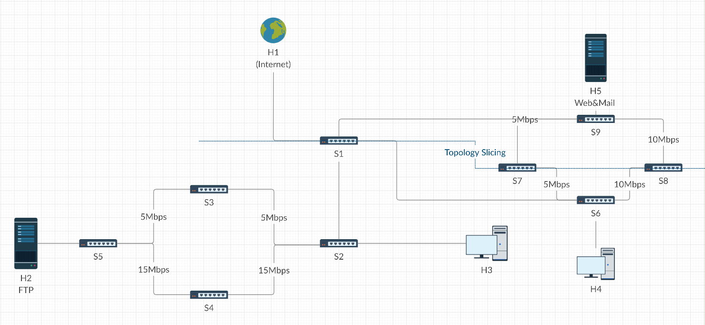

# ComNetsEmu SDN slicing project
Repository for the project of the Softwarized and Virtualized Networks course @UniTn, Academic Year 2019/2020, themed as SDN slicing in ComnetsEmu.
Author: Matteo Strada.
The considered scenario is that of a corporate network with different needs with respect to the type traffic and its destinations. Different slicing techniques (topology, service and hybrid) are adopted to properly isolate the network traffic in their appropriate slice.

# Preamble
For this project, we will simulate a corporate network. In order to do so, we will use ComNetsEmu as our testbed to create simulate the network, implement the slicing techniques via the RYU SDN controller and simulate the appropriate traffic flowing through them.

Tools needed:
- Vagrant v2.2.5
- Virtualbox v5.8/v6

Since the core component of this project is ComNetsEmu, please refer to their own documentation for the installation procedure as it is complete. I strongly recommend, as they suggest, to install it in a Vagrant managed VM. Also, if for whatever reason it fails installing pip dependencies (as it happened to my machine), take note of what failer, search in the installation script and install them manually, it should be ready to go afterwards.
ComNetsEmu repo link: https://git.comnets.net/public-repo/comnetsemu

# Installation
Once ComNetsEmu is ready start the Vagrant machine and ssh into it with: 
```bash
vagrant up
vagrant ssh
```

When in the vagrant VM, you need to download the files with:
```bash
git clone https://github.com/mstreet97/ComnetsEmu-SDN-slicing-project
```

We are ready to go, now just enter the directory and run the reset.sh script, which clears any previously instances of mininet, instructs the RYU SDN controller on how to slice the network and then creates the topology specified in network.py in mininet:
```bash
cd ComnetsEmu-SDN-slicing-project
./reset.sh
```

We are good to go now!

# Network Topology
As previously stated, the idea is that of simulating a corporate network, composed by an intranet and a DMZ. The creation of the hosts and switches is done in the network.py file. To each switch-to-switch link is assigned a different bandwidth depending on which traffic should flow on that specific path. The complete network from a birds-eye view can be seen in the image below.


# Network slicing
Since we need to slice the traffic according to a specific topology, a specific service and even a combination of the two, there will be different techniques working together.
Slicing is done so that the traffic belonging to the intranet and the DMZ cannot communicate with each other, not even the ping is allowed. The only exception to this partitioning is RDP and IMAP traffic, that allow a host in the intranet to access the webserver in the DMZ via RDP and the mail server via IMAP. Inside the intranet, there are two slices to access the internal server, one for the general traffic and one wit higher bandwidth dedicated to ftp traffic (port 20).

In this snippet of service_slicing.py, you can see, in order of which rules gets applied first, how the slicing is done:
```python 
# outport = slice_to_port[dpid][in_port]
self.slice_to_port = {
    1: {1: 2, 2: 1, 3: 4, 4: 3}
}

# out_port = self.mac_to_port[dpid][mac_address]
self.mac_to_port = {
    2: {"00:00:00:00:00:04": 1, "00:00:00:00:00:03": 4},
    5: {"00:00:00:00:00:02": 3},
    6: {"00:00:00:00:00:04": 4},
    9: {"00:00:00:00:00:05": 4}
}

# outport = self.slice_ports[dpid][slicenumber]
self.slice_ports = {2: {1: 3, 2: 2}, 5: {1: 2, 2: 1}, 6: {2: 3, 3: 2, 4: 1}, 9: {2: 3, 4: 1, 3: 2}}
self.end_swtiches = [2, 5, 6, 9]
```
The script will in fact check at first to which of the two topology sliced part of the network the packet belongs. It will then check wheter the destination MAC address is reachable from the destination switch, and finally, if this is not the case, routes the packet according the which slice it belongs.

The enforcing of said rules is done in the same script as can be seen below (I will report only one, as the mechanisms is similar, it just changes depending on the actual type of traffic):
```python
elif (pkt.get_protocol(tcp.tcp) and (pkt.get_protocol(tcp.tcp).dst_port == self.slice_RDPdata or pkt.get_protocol(tcp.tcp).src_port == self.slice_RDPdata)):
    slice_number = 3
    out_port = self.slice_ports[dpid][slice_number]
    match = datapath.ofproto_parser.OFPMatch(
        in_port=in_port,
        eth_dst=dst,
        eth_src=src,
        eth_type=ether_types.ETH_TYPE_IP,
        ip_proto=0x06,  # tcp
        tcp_dst=self.slice_FTPdata,
    )
    actions = [datapath.ofproto_parser.OFPActionOutput(out_port)]
    self.add_flow(datapath, 1, match, actions)
    self._send_package(msg, datapath, in_port, actions)
```
As you can see, this snippet checks the protocol of the packet and it's destination or source port, and if it matches it assigns it a slice number and routes according to the rules above.

# Testing
Once up and running, inside mininet we can give the Pingall command, to see which hosts are connected together.
```bash
mininet> pingall
*** Ping: testing ping reachability
h1 -> X X X h5 
h2 -> X h3 h4 X 
h3 -> X h2 h4 X 
h4 -> X h2 h3 X 
h5 -> h1 X X X 
*** Results: 60% dropped (8/20 received)
```
As you can see the host h1 (representing 'all' traffic from internet), can only communicate with h5 (representing the web and mail server) in the DMZ, while inside the intranet, the three hosts h2 (ftp server), h3 and h4 can freely communicate with each other.

We can now test how traffic communicate inside the intranet, for instance by running an iperf on a random port between h2 and h3:
```bash
mininet> h2 iperf -s -b 15M &
mininet> h3 iperf -c 10.0.0.2 -b 15M -t 10 -i 1
------------------------------------------------------------
Client connecting to 10.0.0.2, TCP port 5001
TCP window size: 85.3 KByte (default)
------------------------------------------------------------
[  3] local 10.0.0.3 port 58282 connected with 10.0.0.2 port 5001
[ ID] Interval       Transfer     Bandwidth
[  3]  0.0- 1.0 sec   768 KBytes  6.29 Mbits/sec
[  3]  1.0- 2.0 sec   512 KBytes  4.19 Mbits/sec
[  3]  2.0- 3.0 sec   512 KBytes  4.19 Mbits/sec
[  3]  3.0- 4.0 sec   512 KBytes  4.19 Mbits/sec
[  3]  4.0- 5.0 sec   512 KBytes  4.19 Mbits/sec
[  3]  5.0- 6.0 sec   512 KBytes  4.19 Mbits/sec
[  3]  6.0- 7.0 sec   640 KBytes  5.24 Mbits/sec
[  3]  7.0- 8.0 sec   512 KBytes  4.19 Mbits/sec
[  3]  8.0- 9.0 sec   255 KBytes  2.09 Mbits/sec
[  3]  9.0-10.0 sec   512 KBytes  4.19 Mbits/sec
[  3]  0.0-10.2 sec  5.12 MBytes  4.23 Mbits/sec
```
We can see here that the traffic is in fact using the slice for the "common" traffic, with the 5Mbps link.

Inside the intranet we can also make use of a dedicated slice for FTP data traffic (TCP port 20):
```bash
mininet> h2 iperf -s -p 20 -b 15M &
mininet> h3 iperf -c 10.0.0.2 -p 20 -b 15M -t 10 -i 1
------------------------------------------------------------
Client connecting to 10.0.0.2, TCP port 20
TCP window size: 85.3 KByte (default)
------------------------------------------------------------
[  3] local 10.0.0.3 port 59074 connected with 10.0.0.2 port 20
[ ID] Interval       Transfer     Bandwidth
[  3]  0.0- 1.0 sec  1.38 MBytes  11.5 Mbits/sec
[  3]  1.0- 2.0 sec  1.62 MBytes  13.6 Mbits/sec
[  3]  2.0- 3.0 sec  1.62 MBytes  13.6 Mbits/sec
[  3]  3.0- 4.0 sec  1.75 MBytes  14.7 Mbits/sec
[  3]  4.0- 5.0 sec  1.62 MBytes  13.6 Mbits/sec
[  3]  5.0- 6.0 sec  1.62 MBytes  13.6 Mbits/sec
[  3]  6.0- 7.0 sec  1.62 MBytes  13.6 Mbits/sec
[  3]  7.0- 8.0 sec  1.62 MBytes  13.6 Mbits/sec
[  3]  8.0- 9.0 sec  1.62 MBytes  13.6 Mbits/sec
[  3]  9.0-10.0 sec  1.75 MBytes  14.7 Mbits/sec
[  3]  0.0-10.1 sec  16.2 MBytes  13.5 Mbits/sec
```
We can in fact see that by running an iperf on TCP/20 h2 and h3 use the 15Mbps link to communicate.

As previously mentioned, even if the intranet and the DMZ cannot ping each other (and should not usually communicate because of the topology slicing technique), I wanted to provide access to the DMZ from the intranet so that an hypotetical employee could be able to update the company website via RDP (on TCP or UDP indifferently) and also access the IMAP server to retrieve the email. In order to try to be as realistic as possible this mutual access (which if not done carefully can lead to anauthorized access to the intranet) is limited between h4 and h5 and only on the ports 993 and 3389.
We can see here an example of IMAP traffic between h5 and h4, which uses a 5Mbps link:
```bash
mininet> h5 iperf -s -p 993 -b 10M &
mininet> h4 iperf -c 10.0.0.5 -p 993 -b 10M -t 10 -i 1
------------------------------------------------------------
Client connecting to 10.0.0.5, TCP port 993
TCP window size: 85.3 KByte (default)
------------------------------------------------------------
[  3] local 10.0.0.4 port 48160 connected with 10.0.0.5 port 993
[ ID] Interval       Transfer     Bandwidth
[  3]  0.0- 1.0 sec   768 KBytes  6.29 Mbits/sec
[  3]  1.0- 2.0 sec   512 KBytes  4.19 Mbits/sec
[  3]  2.0- 3.0 sec   640 KBytes  5.24 Mbits/sec
[  3]  3.0- 4.0 sec   640 KBytes  5.24 Mbits/sec
[  3]  4.0- 5.0 sec   512 KBytes  4.19 Mbits/sec
[  3]  5.0- 6.0 sec   640 KBytes  5.24 Mbits/sec
[  3]  6.0- 7.0 sec   512 KBytes  4.19 Mbits/sec
[  3]  7.0- 8.0 sec   640 KBytes  5.24 Mbits/sec
[  3]  8.0- 9.0 sec   512 KBytes  4.19 Mbits/sec
[  3]  9.0-10.0 sec   640 KBytes  5.24 Mbits/sec
[  3]  0.0-10.1 sec  5.88 MBytes  4.87 Mbits/sec
```

Regarding RDP, we can see here an example of iperf between h4 and h5, both via TCP and UDP, using a 10Mbps link:
```bash
mininet> h5 iperf -s -p 3389 -b 10M &
mininet> h4 iperf -c 10.0.0.5 -p 3389 -b 10M -t 10 -i 1
------------------------------------------------------------
Client connecting to 10.0.0.5, TCP port 3389
TCP window size: 85.3 KByte (default)
------------------------------------------------------------
[  3] local 10.0.0.4 port 35168 connected with 10.0.0.5 port 3389
[ ID] Interval       Transfer     Bandwidth
[  3]  0.0- 1.0 sec  1.38 MBytes  11.5 Mbits/sec
[  3]  1.0- 2.0 sec  1.38 MBytes  11.5 Mbits/sec
[  3]  2.0- 3.0 sec  1.12 MBytes  9.44 Mbits/sec
[  3]  3.0- 4.0 sec  1.12 MBytes  9.44 Mbits/sec
[  3]  4.0- 5.0 sec  1.50 MBytes  12.6 Mbits/sec
[  3]  5.0- 6.0 sec  1.12 MBytes  9.44 Mbits/sec
[  3]  6.0- 7.0 sec  1.25 MBytes  10.5 Mbits/sec
[  3]  7.0- 8.0 sec  1.38 MBytes  11.5 Mbits/sec
[  3]  8.0- 9.0 sec  1.25 MBytes  10.5 Mbits/sec
[  3]  9.0-10.0 sec   768 KBytes  6.29 Mbits/sec
[  3]  0.0-10.1 sec  12.2 MBytes  10.2 Mbits/sec
```

```bash
mininet> h5 iperf -s -u -p 3389 -b 10M &
------------------------------------------------------------
Server listening on UDP port 3389
Receiving 1470 byte datagrams
UDP buffer size:  208 KByte (default)
------------------------------------------------------------
mininet> h4 iperf -c 10.0.0.5 -u -p 3389 -b 10M -t 10 -i 1
------------------------------------------------------------
Client connecting to 10.0.0.5, UDP port 3389
Sending 1470 byte datagrams, IPG target: 1121.52 us (kalman adjust)
UDP buffer size:  208 KByte (default)
------------------------------------------------------------
[  3] local 10.0.0.4 port 54692 connected with 10.0.0.5 port 3389
[ ID] Interval       Transfer     Bandwidth
[  3]  0.0- 1.0 sec   972 KBytes  7.96 Mbits/sec
[  3]  1.0- 2.0 sec   945 KBytes  7.74 Mbits/sec
[  3]  2.0- 3.0 sec   576 KBytes  4.72 Mbits/sec
[  3]  3.0- 4.0 sec  1.02 MBytes  8.60 Mbits/sec
[  3]  4.0- 5.0 sec  1.12 MBytes  9.40 Mbits/sec
[  3]  5.0- 6.0 sec  1.12 MBytes  9.40 Mbits/sec
[  3]  6.0- 7.0 sec  1.11 MBytes  9.28 Mbits/sec
[  3]  7.0- 8.0 sec  1.09 MBytes  9.14 Mbits/sec
[  3]  8.0- 9.0 sec  1.12 MBytes  9.40 Mbits/sec
[  3]  9.0-10.0 sec  1.12 MBytes  9.40 Mbits/sec
[  3]  0.0-10.0 sec  10.1 MBytes  8.47 Mbits/sec
[  3] Sent 7229 datagrams
[  3] Server Report:
[  3]  0.0-10.1 sec  10.1 MBytes  8.42 Mbits/sec   0.000 ms    0/ 7229 (0%)
[  3] 0.00-10.09 sec  4 datagrams received out-of-order
```